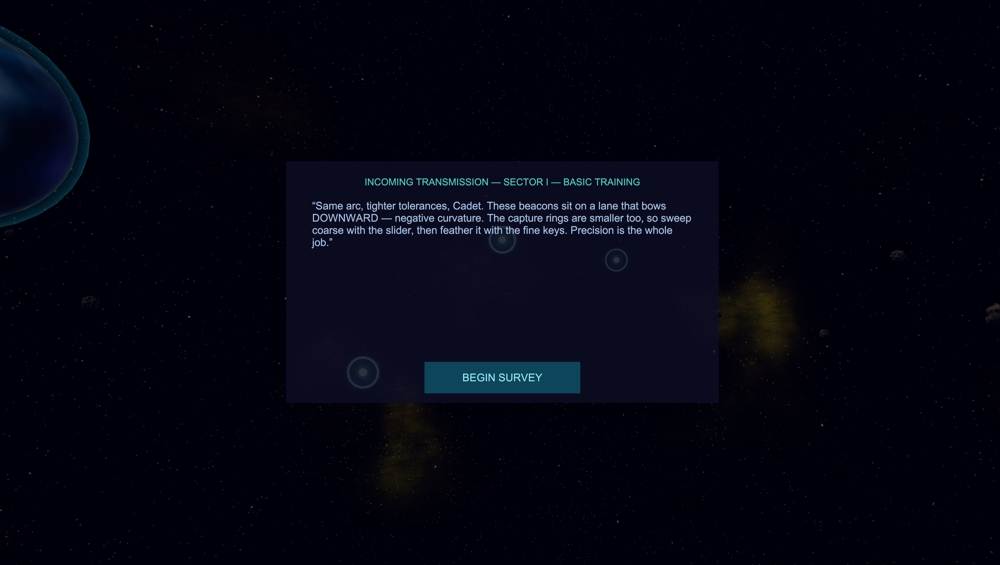

# Space Lanes

**Fit the curve. Chart the lane.** You are an engineer in the Cartographer's
Guild. Explorers died placing the beacons that mark safe passage through hostile
space, and your job is to thread a wormhole lane through every one of them — by
tuning the coefficients of the equation that describes it.

Made by [Wombyland](https://www.wombyland.com/). Windows, single player.


---

## Download

**[⬇ Get the latest release](../../releases/latest)**

| | |
|---|---|
| **Installer** — `SpaceLanes-1.0-Setup.exe` | Recommended. Installs for the current user only, so it needs no administrator rights. Adds a Start menu entry and an optional desktop shortcut. |
| **Portable zip** — `SpaceLanes-1.0-Windows.zip` | No installation. Unzip anywhere and run `Space Lanes.exe`. |

Around 32 MB.

### Windows will warn you about this download

Space Lanes is not code-signed — certificates cost several hundred dollars a
year, which is difficult to justify for a free game. Windows SmartScreen will
show **"Windows protected your PC"** when you run the installer. Click **More
info**, then **Run anyway**.

This warning means Microsoft has not seen the file often enough to have formed an
opinion of it. It is not a virus report. Every release lists a SHA-256 checksum
you can compare against `Get-FileHash` in PowerShell.

**If Windows refuses outright, with no "Run anyway" option**, you have Smart App
Control switched on. That is stricter than SmartScreen and blocks unsigned
software rather than warning about it, with no per-application exception. The
portable zip sometimes passes where the installer does not.

---

## Requirements

| | |
|---|---|
| **Operating system** | Windows 10 or 11, 64-bit |
| **Disk space** | Roughly 150 MB installed |

---

## What you actually do

The lane is a curve, and the curve is an equation. It is shown to you, live, at
the bottom of the screen:

```
y = a·x² + b·x + c
```

Each coefficient has a slider, colour-matched to its term. Move **a** and the
lane's curvature changes. Move **c** and the whole thing shifts. Somewhere in
that space is a set of values where the lane passes through every beacon.

**FIT** reads out how close you are as a percentage, so you always know whether
a change helped. **ENGAGE** commits, and names any beacon you missed rather than
simply refusing. Hazards must be avoided — a lane that touches a mine is not a
lane.

It is coordinate geometry with the graph paper taken away and something at stake
instead. You will not be asked to solve anything symbolically; you develop a feel
for what each coefficient *does* by watching it happen.


---

## Sixteen lanes, six sectors

Each sector introduces a new kind of curve rather than a harder version of the
last one.

| Sector | |
|---|---|
| **I** | Basic Training — quadratics |
| **II** | Curves & Inflections |
| **III** | Into the Third Dimension |
| **IV** | Spirals (Helices) |
| **V** | Harmonics (Lissajous) |
| **VI** | The Deep Charts |

Levels unlock as you complete them, and each is rated out of **three stars** on
how precisely you threaded it.

---

## When you get stuck

Three levels of help, escalating, and none of them hidden.

| | |
|---|---|
| **SCAN** | Names the coefficient furthest from a solution and which way to move it. Free. |
| **NUDGE** | Moves that coefficient part of the way there for you. Free. |
| **REVEAL** | Draws the charted lane in gold beside yours. **Costs you stars.** |

Only the last one is penalised, so you can ask which direction to go as often as
you like without being punished for it.



Between levels, the Guild sends transmissions that explain what the next sector's
mathematics is doing — in character, and in plain language.

---

## Controls

| Action | Control |
|---|---|
| Tune a coefficient | Drag its slider |
| Commit the lane | `ENGAGE` |
| Which way to move? | `SCAN` |
| Move it for me | `NUDGE` |
| Show me the answer | `REVEAL` — costs stars |
| Back to survey defaults | `RESET` |
| Return to the sector map | `SECTOR MAP` |
| Orbit the view | Drag |
| Zoom | Mouse wheel |

---

## Uninstalling

Installed with the installer: **Settings → Apps → Installed apps → Space Lanes →
Uninstall**. Used the zip: delete the folder.

Your progress — unlocked sectors and star ratings — is kept in the Windows
registry under `HKEY_CURRENT_USER\Software\Wombyland\Space Lanes`, and the
uninstaller leaves it alone. Delete that key by hand if you want a clean slate.
The log file lives in
`%UserProfile%\AppData\LocalLow\Wombyland\Space Lanes`.

---

## Reporting a problem

Open an [issue](../../issues). What helps most: which sector and lane you were
on, your Windows version, and the log from
`%UserProfile%\AppData\LocalLow\Wombyland\Space Lanes\Player.log`.

---

## About

Space Lanes is one of several games at
**[wombyland.com](https://www.wombyland.com/)**, where it can also be played in a
browser.

The skyboxes and spacecraft models are third-party work used under licence — see
[ATTRIBUTION.md](ATTRIBUTION.md). Everything else, including the lane
mathematics, the level design and the procedural meshes, is original.

This repository distributes the game only. It contains no source code — see
[LICENSE.txt](LICENSE.txt) for terms.
