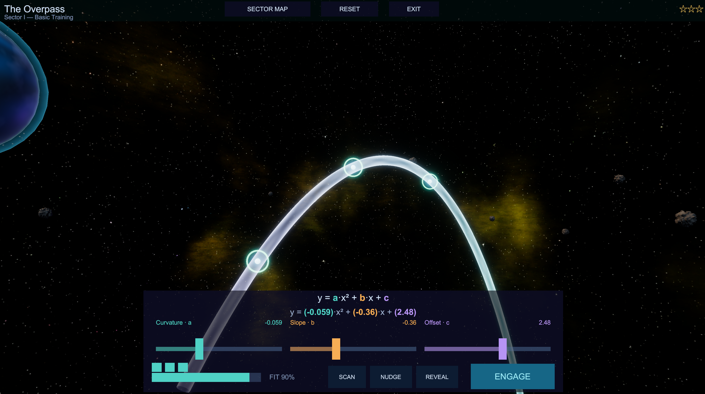
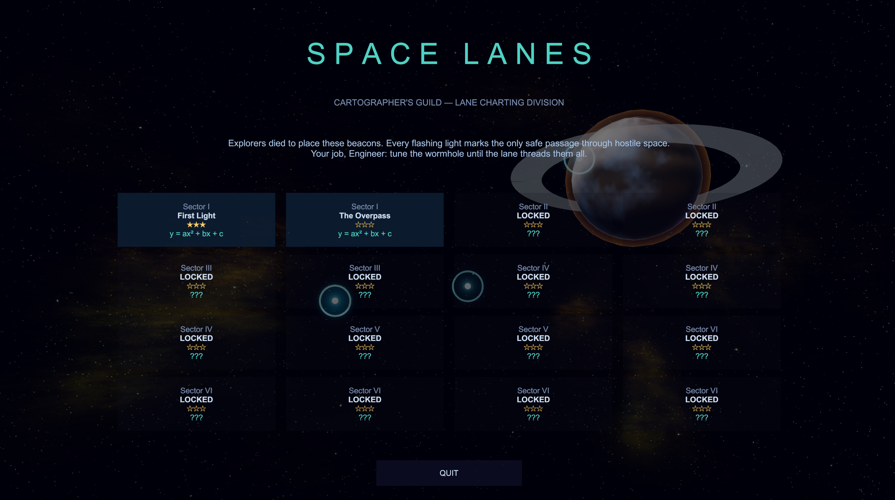

# Space Lanes

**A puzzle about shaping a wormhole.** You are an engineer in the Cartographer's
Guild, Lane Charting Division. Each sector has beacons that must be threaded and
hazards that must not be touched. Your job is to tune the parameters of a lane
until it passes through every beacon cleanly.

Made by [Wombyland](https://www.wombyland.com/). Windows, single player.

---

## Download

**[⬇ Get the latest release](../../releases/latest)**

| | |
|---|---|
| **Installer** — `SpaceLanes-1.0-Setup.exe` | Recommended. Installs for the current user only, so it needs no administrator rights. Adds a Start menu entry and an optional desktop shortcut. |
| **Portable zip** — `SpaceLanes-1.0-Windows.zip` | No installation. Unzip anywhere and run `Space Lanes.exe`. |

### Windows will warn you about this download

Space Lanes is not code-signed — certificates cost several hundred dollars a
year, which is difficult to justify for a free game. Windows SmartScreen will
show **"Windows protected your PC"** when you run the installer. Click **More
info**, then **Run anyway**.

This warning means Microsoft has not seen the file often enough to have formed an
opinion of it. It is not a virus report. Every release lists a SHA-256 checksum
you can compare against `Get-FileHash` in PowerShell.

**If Windows refuses outright, with no "Run anyway" option**, you have Smart App
Control switched on. That is stricter than SmartScreen and blocks unsigned
software rather than warning about it, with no per-application exception. The
portable zip sometimes passes where the installer does not.

---

## Requirements

| | |
|---|---|
| **Operating system** | Windows 10 or 11, 64-bit |
| **Disk space** | Roughly 150 MB installed |

---

## How it plays

A lane is a curve through space, and you do not draw it. You **tune** it.

Each sector gives you a set of parameters on the control deck. Moving them
reshapes the lane — bending it, twisting it, stretching it through the sector.
Somewhere in that space of possibilities is a shape that threads every beacon.
Your job is to find it.

**FIT** shows how close you are, as a percentage. It rises as the lane
approaches a solution, so you can tell whether a change helped without guessing.

**Beacons must be captured.** Hazards — mines, fields, obstacles — must be
avoided. A lane that touches one is not a lane.

**ENGAGE** commits your solution. If any beacon is missed, the game tells you
which, and you go back to tuning.

Sixteen sectors, each with its own shape and name — *First Light*, *The
Serpent's Bend*, *Mine Alley*, *Threading the Needle*, *The Wake* — building from
a gentle first curve to lanes that need real precision.

---

## When you get stuck

Two levels of help, and the game does not hide them behind anything.

**NUDGE** finds whichever parameter is furthest from a working value and moves it
toward one. It tells you which parameter it touched, so it teaches rather than
simply solving. If everything is already close it says so rather than fiddling.

**REVEAL** draws the charted solution as a gold lane alongside yours. Use it when
you want to see the answer's shape rather than derive it.

---

## Controls

| Action | Control |
|---|---|
| Tune a parameter | Drag its slider on the control deck |
| Commit the lane | `ENGAGE` |
| Hint — adjust the worst parameter | `NUDGE` |
| Hint — show the charted lane | `REVEAL` |
| Back to survey defaults | `RESET` |
| Return to the sector map | `SECTOR MAP` |
| Orbit the view | Drag |
| Zoom | Mouse wheel |

---

## Uninstalling

Installed with the installer: **Settings → Apps → Installed apps → Space Lanes →
Uninstall**. Used the zip: delete the folder.

Settings and progress live in
`%UserProfile%\AppData\LocalLow\Wombyland\Space Lanes` and are left alone by the
uninstaller. Delete that folder by hand if you want them gone.

---

## Reporting a problem

Open an [issue](../../issues). What helps most: which sector you were on, your
Windows version, and the log from
`%UserProfile%\AppData\LocalLow\Wombyland\Space Lanes\Player.log`.

---

## About

Space Lanes is one of several games at
**[wombyland.com](https://www.wombyland.com/)**, where it can also be played in a
browser.

The skyboxes and spacecraft models are third-party work used under licence — see
[ATTRIBUTION.md](ATTRIBUTION.md). Everything else, including the lane
mathematics and level design, is original.

This repository distributes the game only. It contains no source code — see
[LICENSE.txt](LICENSE.txt) for terms.
